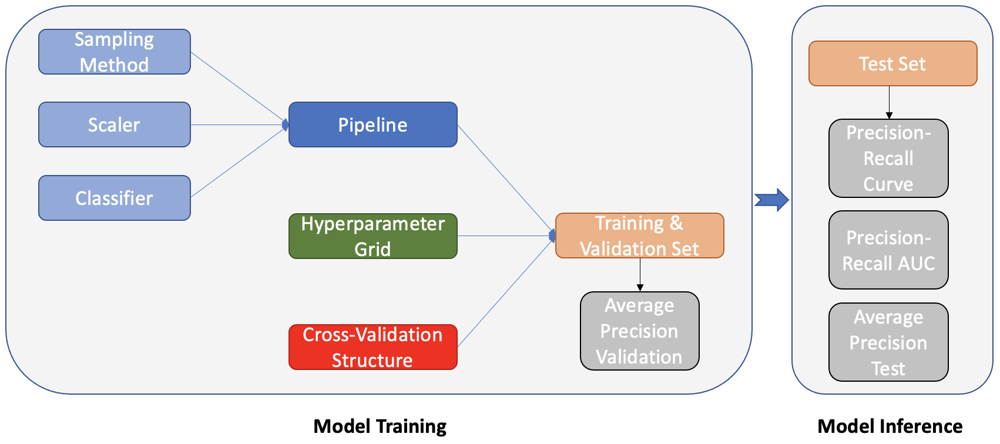
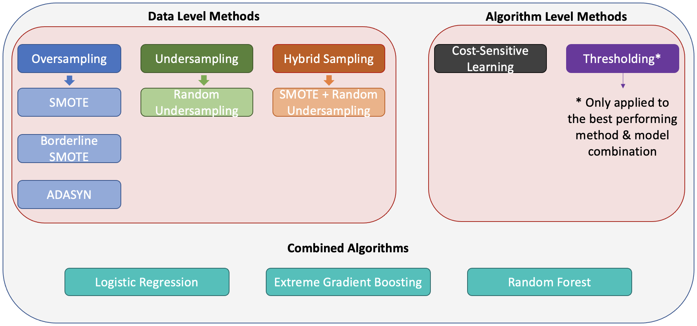

# Introduction

This study aims to predict the converting sessions of an E-commerce company in the automotive sector. The main challenge that this study addresses is the severe class imbalance.  


* This project offers the implementation of 6 methods against class imbalance combined with 3 different algorithms.
* The methods that are applied are of two familes; Data-Level Methods & Algorithm-Level Methods.
* The study uses Average Precision and PR AUC as the main performance metrics for comparison. F1 Score, Precision and Recall are also analysed for the best performing algorithm.
* A two step hyperparameter tuning approach is conducted which includes Bayesian Search and Grid Search.
* Bayesian Search is applied to only Random Undersampling and Cost Sensitive Learning due to time constraints.
* Further thresholding is applied to only best performing method-algorithm combination which is cost-sensitive learning combined with XGBoost.

# Model Structure



# Methods and Algorithms



# Examples

## Example 1: SMOTE with Random Forest - Grid Search

```
# Define the pipeline
pipeline3 = imbpipeline(steps = [['smote', SMOTE(random_state=11)],
                                ['scaler', StandardScaler()],
                                ['classifier', RandomForestClassifier()]])

# Define the parameter grid for RF

param_grid3 = {
    'classifier__random_state': [11],
    'classifier__max_depth': [10] ,
    'classifier__n_estimators': [5000],
    'classifier__max_features': [20,None],
    'classifier__bootstrap': [False]
    
}


# Define the cross validation structure
stratified_kfold3 = StratifiedKFold(n_splits=5,
                                       shuffle=True,
                                       random_state=11)

# Grid Search
grid_search3 = GridSearchCV(estimator=pipeline3,
                           param_grid=param_grid3,
                           scoring='average_precision',
                           cv=stratified_kfold3,
                           n_jobs=-1,
                           verbose=0)
                                   
```

## Example 2: SMOTE + Random Undersampling with Logistic Regression - Grid Search

```
# Define the pipeline
pipeline4 = imbpipeline(steps = [['over', SMOTE(random_state=11,sampling_strategy=0.1)],
                                ['under', RandomUnderSampler(random_state=11,sampling_strategy=0.5)],
                                ['scaler', StandardScaler()],
                                ['classifier', LogisticRegression()]])

# Define the parameter grid for Logistic Regression
param_grid4 = {'classifier__max_iter':[3538],
              'classifier__random_state':[11],
              "classifier__penalty": ["l2"],
              "classifier__C": [911.8],
              "classifier__fit_intercept": [True]}

# Define the cross validation structure
stratified_kfold4 = StratifiedKFold(n_splits=5,
                                       shuffle=True,
                                       random_state=11)

# Grid Search
grid_search4 = GridSearchCV(estimator=pipeline4,
                           param_grid=param_grid4,
                           scoring='average_precision',
                           cv=stratified_kfold4,
                           n_jobs=-1,
                           verbose=0)
```

## Example 3: Cost-Sensitive Learning with Extreme Gradient Boosting - Bayesian Search


```
# Define the pipeline
pipeline20 = imbpipeline(steps = [['scaler', StandardScaler()],
                                ['classifier', XGBClassifier()]])

# Define the parameter grid for XGB

param_grid20 = {
    'classifier__objective':['binary:logistic'],
    'classifier__random_state': [11],
    'classifier__learning_rate': Real(0.01, 0.2, prior="log-uniform"),
    'classifier__subsample': Real(0.5, 1),
    'classifier__colsample_bytree': Real(0.5, 1),
    'classifier__n_estimators': Integer(1, 5000),
    'classifier__max_depth': Integer(2, 10),
    'classifier__scale_pos_weight': Integer(1,400)
}

# Define the cross validation structure
stratified_kfold20 = StratifiedKFold(n_splits=5,
                                       shuffle=True,
                                       random_state=11)

# Bayesian Search
grid_search20 = BayesSearchCV(estimator=pipeline20,
                           search_spaces=param_grid20,
                           scoring='average_precision',
                           cv=stratified_kfold20,
                           n_jobs=-1,
                           verbose=0)
```

# Requirements

* imblearn
* matplotlib
* numpy
* pandas
* seaborn
* sklearn
* skopt
* xgboost

# Further Notes

The experiments are conducted on MacOS 12.3.1 and Python 3.9.7

The data file is not shared along with any preprocessing applied to the dataset due to data privacy concerns. The notebook includes all the methods that are applied and the results that are obtained from these approaches.

For the full code you can refer to [here](Thesis_Final.ipynb). The table of contents in the notebook becomes interactable when opened with Jupyter Notebook. 

For further information you can refer to the [here](Thesis_Berkay_Kocak_614468.pdf). 
